# Báo cáo Lab Day 1 — Nguyễn Phúc Huy — 2A202602911

## 1. Thiết lập

- **Môi trường:** Google Colab, GPU **Tesla T4** (`gpu-t4-s`), `torch 2.11.0+cu130`, Python 3.13. Không dùng eval
  cho bất kỳ quyết định nào; `scripts/evaluate.py` chỉ chạy một lần cho baseline và một lần cho cấu hình cuối.
- **Dữ liệu:** Forest CoverType (7 lớp, 54 đặc trưng). Chia cố định theo `split_metadata.csv`:
  `train` 464 809 / `eval` 116 203. Validation tách **từ train**: 20 %, phân tầng, seed 42 →
  **371 847 train / 92 962 val**. Chuẩn hoá **chỉ 10 cột số**, bằng thống kê của phần train còn lại
  (đo lại: `|mean|max = 3,6e-07`, `std ≈ 1,0000`).
- **Model:** `M-base` (54→256→128→7, **47 879 tham số**, có `assert`), ReLU sau mỗi lớp ẩn, dropout chỉ sau
  ReLU, **không** softmax trong model. Khởi tạo: **He cho lớp ẩn**, **lớp ra N(0; 0,01²) + bias 0** — theo
  đúng khuyến nghị ở mục *Chẩn đoán* của GUIDE ("giảm tỉ lệ W lớp cuối, đặt bias = 0") để logits ≈ 0 ở bước 0.
- **Baseline:** cross-entropy · SGD + momentum 0,9 · lr **0,1** (chọn bằng val, xem §2) · batch 512 · 20 epoch ·
  dropout 0 · không clip · FP32 · seed 1 (và 2, 3 để đo nhiễu).
- **Mốc tham chiếu:** "đoán luôn lớp đa số (lớp 1)" cho accuracy **0,4876** và macro-F1 **0,0937** — đo lại đúng
  bằng `evaluate.py` trên file dự đoán ngẫu nhiên (khớp mốc ≈ 0,09 trong README).
- **Chủ đề đã thử:** ☑ loss ☑ optimizer ☑ hyper-parameter ☑ dropout ☑ clipping ☑ mixed precision ☑ init.
  Tổng **29 lần chạy**, mỗi lần một dòng trong `experiments.xlsx`, mỗi lần một ảnh `figures/<exp_id>.png`.

## 2. Kiểm tra ban đầu và độ nhiễu

| Kiểm tra | Kết quả |
|---|---|
| Số tham số / shape logits | 47 879 / (B, 7) — có `assert`, đúng bảng quy định |
| Loss bước 0 (so với ln 7 = 1,9459) | **1,9742** (lệch +0,0283) — model ở Part 1 (seed 42); dòng `base-s1` trong bảng ghi 1,9614 (seed 1) |
| Quá khớp 20 mẫu: loss cuối | **0,0000**, accuracy 20/20 = 1,000 |
| Mọi tham số có gradient khác 0 | ☑ có — 6/6 tensor `‖g‖` = 0,089 / 0,031 / 0,221 / 0,034 / 2,341 / 0,544 |
| Số seed baseline đã chạy | 3 (`base-s1`, `base-s2`, `base-s3`) |
| Baseline: val acc (TB ± σ) | **0,9081 ± 0,0021** |
| Baseline: val macro-F1 (TB ± σ) | **0,8518 ± 0,0021** |

**Ngưỡng nhiễu dùng trong toàn báo cáo: 2σ = 0,0041** (val macro-F1, từ 3 seed baseline, sheet `Seeds` trong
`experiments.xlsx`). Lưu ý: cột `delta_val_f1_vs_base` của bảng tính Δ so với **trung bình 3 seed baseline =
0,8518**, còn `base-s1` — cùng seed với mọi thí nghiệm khác — là **0,8513**; trong các bảng dưới tôi ghi rõ giá trị nào. Mọi chênh lệch
nhỏ hơn mức này **không** được coi là bằng chứng. Ảnh: `figures/compare_baseline_seeds.png`.

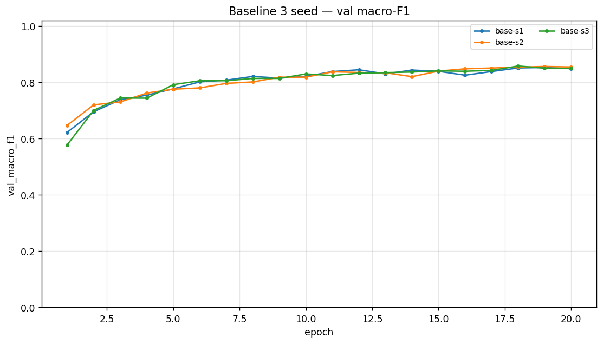
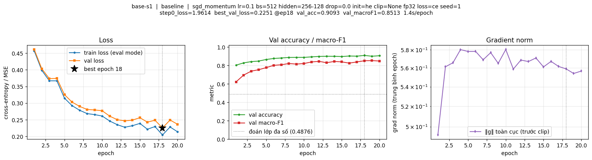

**Dò lr cho baseline bằng val:** lr = 0,01 → 0,7504; 0,03 → 0,8273; **0,1 → 0,8513** (val acc 0,9093)
⇒ chọn lr = 0,1. Ba giá trị chỉ khác độ dài bước cập nhật (cùng 20 epoch, ≈ 727 bước/epoch), nhưng lr nhỏ
đi quãng đường ngắn hơn ~10× nên vẫn ở mức "loss phẳng" 0,75.

**Nhận xét đường cong baseline:** cả `train_loss` và `val_loss` còn giảm tới epoch cuối và **chưa tách nhau**
(khoảng cách `val_loss − train_loss` ở epoch cuối chỉ **+0,0227**) ⇒ mô hình **chưa quá khớp**; đây là dự đoán
quan trọng cho §3.4. Ảnh: `figures/base-s1.png`.

## 3. Kết quả theo chủ đề

### 3.1 Hàm mất mát — CE vs MSE
- **Dự đoán:** CE hội tụ nhanh hơn vì gradient `p − y` không bão hoà, MSE bị `2(z − y)/7` yếu hơn khi dự đoán sai nặng.
- **Kết quả:** `loss-mse` đạt val macro-F1 **0,7089** (−0,1429 so với baseline, ≫ 2σ; val acc 0,8714). Ảnh:
  `figures/loss-mse.png`, chồng: `figures/compare_loss.png`.

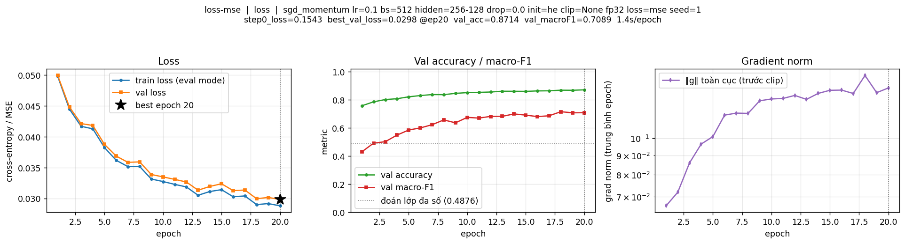
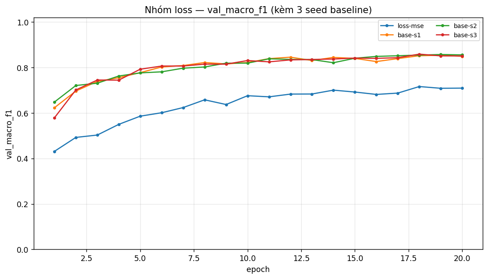
- **Cơ chế:** với logit thô, `∂MSE/∂z = 2(z − y)/7` — tuyến tính và bị chia 7, còn CE cho `p − y`; khi mô hình
  còn sai nhiều, tín hiệu học của MSE yếu hơn hẳn nên hội tụ chậm; thêm nữa MSE lấy trung bình trên cả
  `B × 7` phần tử làm biên độ gradient nhỏ đi. **Không so `val_loss` CE (≈ 0,26) với MSE (0,0298)** — khác thang đo.

### 3.2 Bộ tối ưu hoá
- **Dự đoán:** phải chỉnh lr cho từng bộ rồi so ở lr tốt nhất; AdamW với `wd = 0` phải trùng Adam.
- **Kết quả** (val macro-F1, 20 epoch, cùng split/seed; ảnh `figures/compare_optimizer.png`):

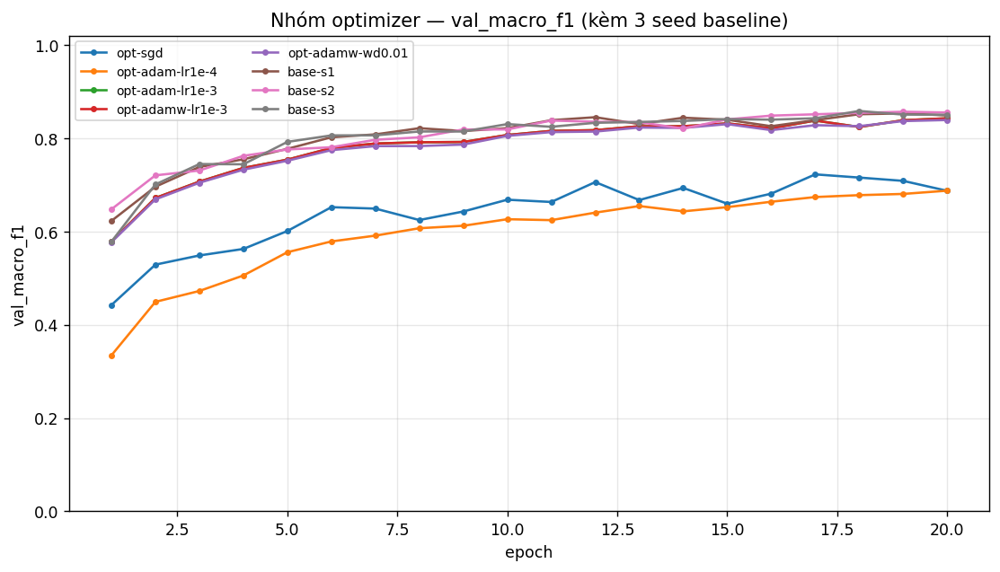

| exp_id | val macro-F1 | Δ vs baseline | > 2σ? |
|---|---|---|---|
| `opt-sgd` (SGD thuần) | 0,7084 | −0,1435 | Có |
| `opt-adam-lr1e-4` | 0,6873 | −0,1645 | Có |
| `opt-adam-lr1e-3` | 0,8425 | −0,0094 | Có |
| `opt-adamw-lr1e-3` (`wd = 0`) | **0,8425** | −0,0094 | Có |
| `opt-adamw-wd0.01` | 0,8388 | −0,0130 | Có |
| `base-s1` (SGD+momentum, lr 0,1) | **0,8513** | — | — |

- **Giải thích:** AdamW `wd = 0` cho kết quả **trùng khít** Adam cùng lr ⇒ đúng lý thuyết (khi λ = 0 hai công
  thức cập nhật giống nhau; AdamW chỉ khác ở chỗ tách riêng số hạng suy giảm trọng số). **lr quan trọng hơn cả
  việc chọn bộ tối ưu:** Adam ở 1e-4 chỉ 0,6873 nhưng ở 1e-3 lên 0,8425 — chênh 0,155, gấp ~38 lần ngưỡng
  nhiễu. Ngay cả Adam tốt nhất vẫn **thấp hơn** SGD+momentum đã chỉnh lr (`base-s1` = 0,8513, TB 3 seed = 0,8518) trong 20 epoch: SGDM dùng lr
  lớn nên mỗi epoch đi xa, còn Adam cần thêm bước để "khởi động" `m` và `v`.

### 3.3 Hyper-parameter
- **Dự đoán:** batch nhỏ (nhiều bước hơn) hội tụ nhanh hơn trong cùng số epoch; mạng rộng hơn tốt hơn, sâu hơn ít lợi.
- **Kết quả** (ảnh `figures/compare_hparam.png`):

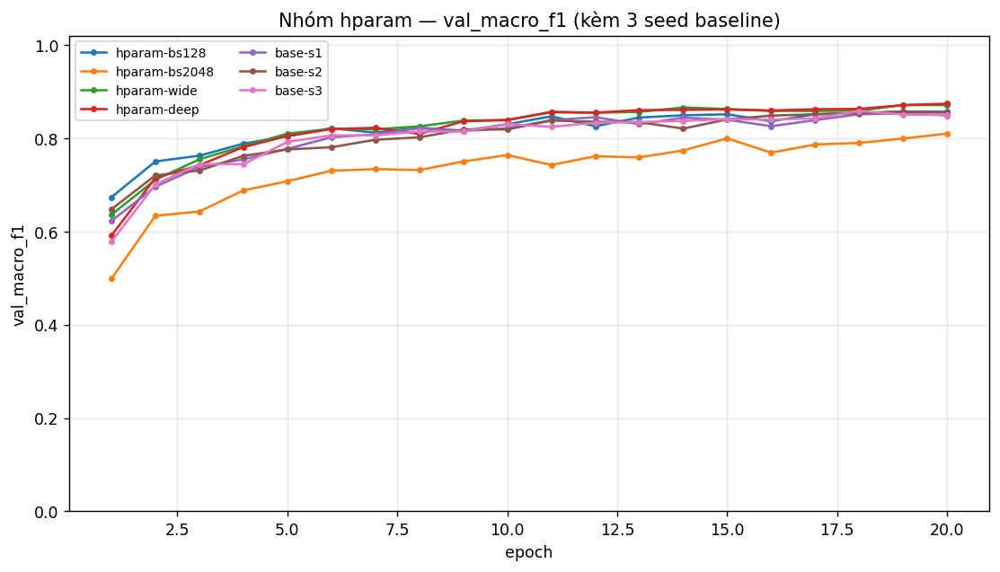

| exp_id | thay đổi | val macro-F1 | Δ vs baseline | > 2σ? | giây/epoch |
|---|---|---|---|---|---|
| `hparam-bs128` | batch 512 → 128 | 0,8566 | +0,0047 | Có | 4,95 |
| `hparam-bs2048` | batch 512 → 2048 | 0,8096 | −0,0422 | Có | **0,37** |
| `hparam-wide` | `M-wide` 512-256 (161 287) | 0,8588 | +0,0070 | Có | 1,37 |
| `hparam-deep` | `M-deep` 256-128-64 (55 687) | **0,8739** | **+0,0221** | Có | 1,45 |

- **Giải thích:** batch 512 → 128 tăng số bước/epoch 4× (727 → 2 904) nhưng **chậm 3,8×** — lợi ích (+0,0047)
  vừa hơn ngưỡng nhiễu, không đáng giá. Batch 2048 chỉ còn 182 bước/epoch nên kém rõ (−0,0422): đúng tình
  huống quy tắc *lô ×k thì η ×k* của slide cảnh báo (tôi chưa tăng lr cho batch 2048 — xem §6). Thêm **chiều
  sâu rẻ và hiệu quả hơn thêm chiều rộng** ở bài này: `M-deep` +0,0221 với 55 687 tham số, còn `M-wide` chỉ
  +0,0070 dù 161 287 tham số (gấp 3,4×).

### 3.4 Dropout
- **Dự đoán:** mô hình **chưa** quá khớp ⇒ dropout không giúp (thậm chí hại).
- **Kết quả:** `drop-0.1` = 0,8456 (−0,0062); `drop-0.3` = **0,7877** (−0,0642) — cả hai dưới baseline và vượt
  2σ. Ảnh: `figures/compare_dropout.png`, `figures/drop-0.3.png`.

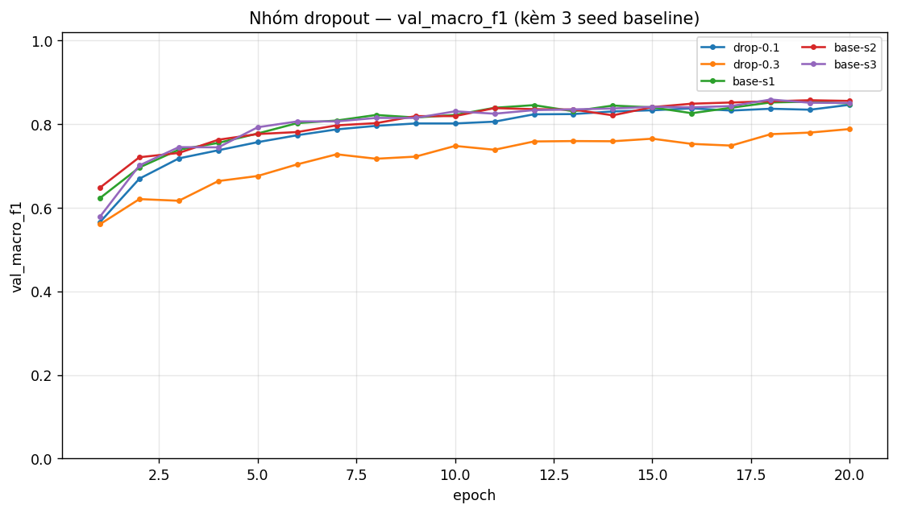
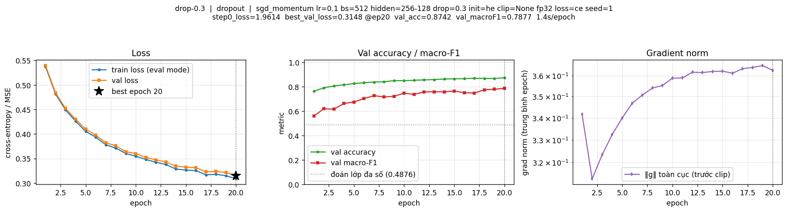

| | `val_loss − train_loss` (epoch cuối) | val macro-F1 |
|---|---|---|
| `base-s1` | +0,0227 | 0,8513 |
| `drop-0.1` | +0,0108 | 0,8456 |
| `drop-0.3` | +0,0062 | 0,7877 |

- **Giải thích:** dropout **có** thu hẹp khoảng cách train–val (0,0227 → 0,0062), nhưng vì mô hình chưa quá
  khớp nên cái giá (mỗi bước tắt 10–30 % nơ-ron ⇒ giảm năng lực biểu diễn hiệu dụng) lớn hơn lợi ích. Kết luận:
  chỉ dùng dropout khi đường train–val **bắt đầu tách**.

### 3.5 Gradient clipping
- **Dự đoán:** chọn `c` từ chính `grad_norm` của baseline; nếu `c` quá lớn thì clipping vô nghĩa.
- **Kết quả:** `‖g‖` trung bình của baseline = **0,5642** ⇒ chọn **`c = 0,282`** (một nửa mức đó, để clipping
  thực sự kích hoạt). Ảnh: `figures/compare_clipping.png`.

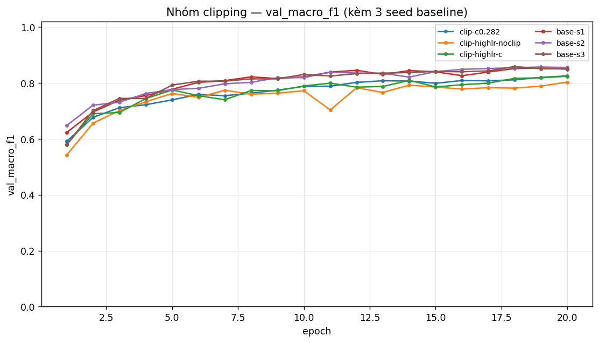

| exp_id | cấu hình | `‖g‖` TB (trước clip) | val macro-F1 |
|---|---|---|---|
| `base-s1` | lr 0,1, không clip | 0,564 | 0,8513 |
| `clip-c0.282` | lr 0,1, clip `c = 0,282` | 0,957 | 0,8108 |
| `clip-highlr-noclip` | lr 1,0 (×10), không clip | 0,249 | 0,8025 |
| `clip-highlr-c` | lr 1,0 (×10), clip `c = 0,282` | 0,254 | **0,8234** |

- **Giải thích:** ở lr bình thường clipping **làm hại** (0,8108 so với 0,8513 của `base-s1`) vì cắt mất gradient chính là tín hiệu học; ở
  lr cao gấp 10 nó **giúp** (+0,021 so với không clip, > 2σ). **Khác dự đoán:** bản không clip ở lr ×10 **không**
  `diverged` — nên phát biểu đúng là "clipping giữ bước cập nhật hữu hạn khi lr quá lớn", **không** phải
  "clipping cứu mạng khỏi NaN".

### 3.6 Mixed precision
- **Dự đoán:** mạng nhỏ ⇒ thời gian bị chi phối bởi chi phí gọi kernel ⇒ FP16 **không** nhanh hơn.
- **Kết quả** (`is_bf16_supported()` trên build Colab này trả về `True`; ảnh `figures/compare_amp.png`):

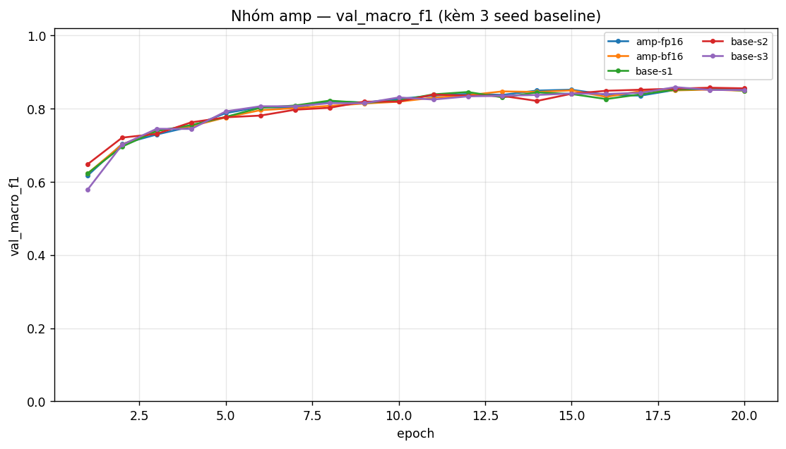

| precision | giây/epoch | bộ nhớ đỉnh | val macro-F1 | Δ vs FP32 |
|---|---|---|---|---|
| FP32 (`base-s1`) | **1,32** | 287 MB | 0,8513 | — |
| FP16 (+ GradScaler) | 1,76 | 287 MB | 0,8507 | −0,0011 (trong nhiễu) |
| BF16 | 1,56 | 287 MB | 0,8493 | −0,0025 (trong nhiễu) |

- **Giải thích:** FP16 chậm hơn 33 %, BF16 chậm hơn 18 % — mỗi epoch chỉ 727 bước nhưng mỗi bước có ~15 kernel
  rất nhỏ, nên chi phí kernel + chuyển dtype chiếm phần lớn, còn tensor core chỉ giúp phần nhân ma trận (nhỏ).
  Độ chính xác không đổi (|Δ| < 2σ) đúng kỳ vọng vì autocast chỉ hạ độ chính xác phép toán, tham số vẫn FP32.
  FP16 cần `GradScaler` vì 5 bit số mũ (`max ≈ 65 504`) làm gradient nhỏ underflow; BF16 có 8 bit số mũ (cùng
  dải FP32) nên không cần scaler, nhưng không có lợi ích tốc độ trên phần cứng T4 (sm_75).

### 3.7 Khởi tạo tham số
- **Dự đoán:** `zeros` hỏng vì đối xứng; `he` (Var = 2/n_in) nhỉnh hơn cho ReLU.
- **Kết quả** (ảnh `figures/compare_init.png`):

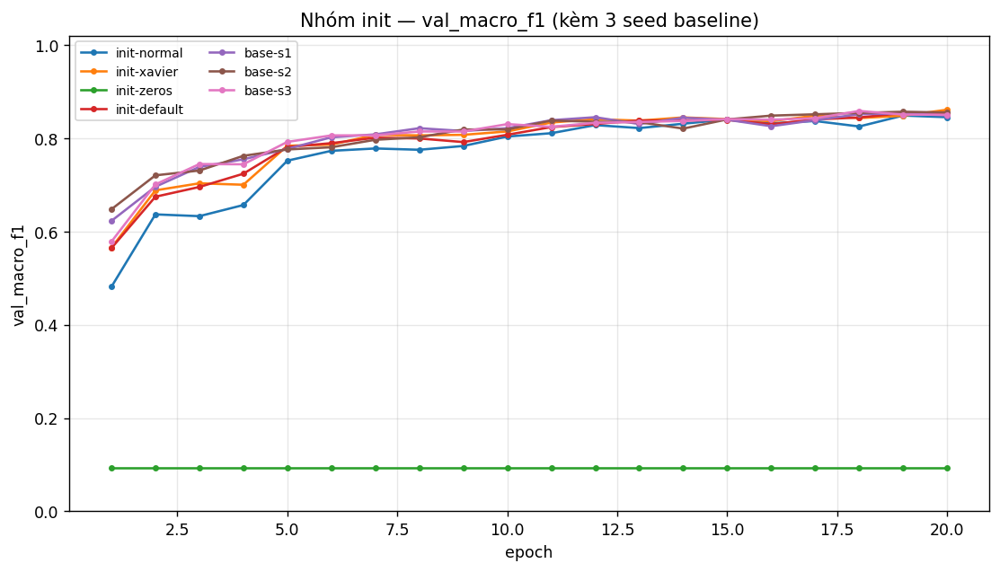

| khởi tạo | val macro-F1 | Δ vs `he` | > 2σ? | std kích hoạt (2 lớp ẩn) | loss bước 0 |
|---|---|---|---|---|---|
| `he` (baseline) | 0,8513 | — | — | 0,410 / 0,406 | 1,9573 |
| `xavier` | **0,8609** | +0,0091 | Có | 0,161 / 0,125 | 1,9519 |
| `default` (`nn.Linear`) | 0,8543 | +0,0024 | Không | 0,160 / 0,065 | 1,9457 |
| `normal` (0,01) | 0,8449 | −0,0069 | Có | 0,021 / 0,002 | 1,9458 |
| `zeros` | **0,0936** | −0,7582 | Có | 0,000 / 0,000 | 1,9459 |

- **Giải thích:** `zeros` chỉ đạt **0,0936 = đúng mức "đoán lớp đa số"** — mạng không học được gì, vì mọi nơ-ron
  trong một lớp nhận gradient giống hệt nhau nên **đối xứng không bao giờ bị phá vỡ** (thêm nữa `ReLU(0) = 0`
  triệt tiêu gradient lớp trước). Lưu ý `loss bước 0` của `zeros` vẫn đẹp (1,9459) ⇒ **loss bước 0 đẹp không
  chứng minh mô hình học được**, phải kèm phép thử quá khớp 20 mẫu. `xavier` nhỉnh hơn `he` (+0,0091) — **khác
  dự đoán**, nhưng hợp lý với mạng chỉ 2 lớp ẩn: std nhỏ hơn (0,16 so với 0,41) làm bước đầu ổn định hơn;
  khác biệt He/Xavier chỉ thực sự quan trọng khi mạng **sâu nhiều lớp** (He giữ std qua các lớp: 0,410 → 0,406,
  trong khi `normal` teo từ 0,021 → 0,002).

## 4. Đánh giá cuối trên tập eval

| Cấu hình | Seed nộp | val macro-F1 | **eval macro-F1** | eval accuracy |
|---|---|---|---|---|
| Baseline (`M-base`, SGDM 0,9, lr 0,1, 20 epoch) | 1 | 0,8513 | **0,8516** | 0,9082 |
| Cấu hình cuối (`M-deep`, Adam lr 1e-3, 40 epoch) | 1 | 0,8805 | **0,8809** | **0,9200** |

- **Cấu hình cuối gồm gì và vì sao:** chọn **chỉ bằng val** — Adam lr 1e-3 là bộ tối ưu tốt nhất nhóm optimizer
  (§3.2), `M-deep` 256-128-64 là kiến trúc tốt nhất nhóm hparam (§3.3), giữ nguyên He-init/batch 512/không
  dropout/không clip (dropout và clipping đều có hại ở lr baseline), và tăng lên 40 epoch vì đường val loss
  chưa hội tụ ở 20 epoch.
- **Cải thiện:** **+0,0292** macro-F1 trên eval (≥ 0,02 và vượt ngưỡng nhiễu 2σ = 0,0041) — hai seed của cấu
  hình cuối cho val 0,8804 ± 0,0001 nên chênh lệch không phải do may mắn của seed.
- **Val vs eval:** lệch chỉ **−0,0004**, xác nhận val là ước lượng đáng tin của eval và không có dấu hiệu chọn
  cấu hình bằng eval. Số lấy nguyên từ `eval_result.json` (không tự tính lại).

### 4.1 Phân tích lỗi theo lớp

| Lớp | support | precision | recall | F1 |
|---|---|---|---|---|
| 0 | 42 368 | 0,9337 | 0,9001 | 0,9166 |
| 1 | 56 661 | 0,9229 | 0,9422 | 0,9325 |
| 2 | 7 151 | 0,8894 | 0,9355 | 0,9119 |
| 3 | 549 | 0,8254 | 0,8525 | 0,8387 |
| 4 | 1 899 | **0,7616** | 0,8394 | **0,7986** |
| 5 | 3 473 | 0,8643 | 0,8031 | 0,8325 |
| 6 | 4 102 | 0,9349 | 0,9354 | 0,9352 |

- **Lớp 4 bị nhầm đi đâu:** trong ma trận, hàng lớp 4 có 1 594/1 899 đúng (recall 0,8394) và phần sai đi
  **chủ yếu sang lớp 1 (248 mẫu)** rồi lớp 2 (24 mẫu); theo chiều ngược lại, lớp 4 bị "hút" mẫu từ **lớp 1 (401 mẫu)**, lớp 0 (61), lớp 2 (22),
  lớp 5 (14), lớp 6 (1) — 499 mẫu dương tính giả này kéo precision xuống 1 594/2 093 = 0,7616.
- **Lớp khó nhất là lớp 4** (F1 = 0,7986, precision 0,7616 — thấp nhất bảng), **không phải lớp hiếm nhất**:
  lớp 3 tuy chỉ 549 mẫu (0,47 %) vẫn đạt 0,8387 vì tách khỏi các lớp khác khá rõ; lớp 4 có precision thấp ⇒
  nhiều mẫu lớp khác bị đoán thành lớp 4, do nó nằm sát miền quyết định của các lớp rừng lân cận.
- **Ô nhầm lớn nhất ngoài đường chéo: thật lớp 0 → đoán lớp 1 (3 911 mẫu, 9,2 % số mẫu lớp 0)** — hai lớp này
  chiếm ~80 % dữ liệu, cùng là rừng kim trên cùng dải độ cao, chỉ khác một phần ở `Soil_Type`/`Wilderness_Area`
  mà 44 cột one-hot có nhiều cặp trùng nhau. Vì lớp 0/1 rất lớn nên sai số của chúng ít ảnh hưởng macro-F1;
  điểm mất lớn nhất nằm ở lớp 4 (support 1 899) vì macro-F1 cho mọi lớp trọng số bằng nhau. Ảnh:
  `figures/confusion_matrix.png`.

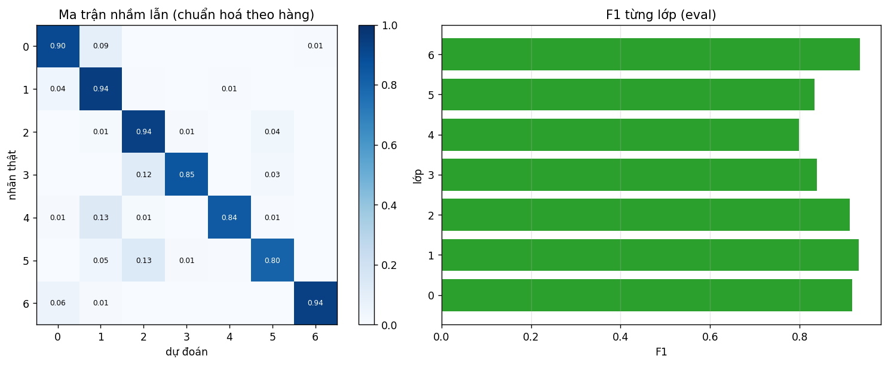
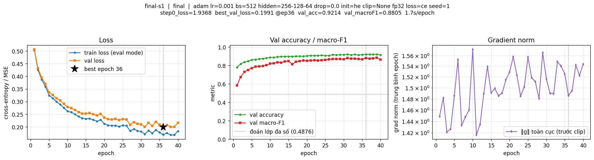
- **Hướng cải thiện:** `class_weight`/focal loss cho lớp 3–4, oversample lớp hiếm, thêm đặc trưng tương tác
  `Elevation × Horizontal_Distance_To_Hydrology` (đúng chỗ nhầm lớp 0/1), và huấn luyện lâu hơn (val loss chưa hội tụ).

## 5. Trả lời các câu hỏi dẫn dắt

1. **Bộ tối ưu nào thắng khi chỉnh lr công bằng?** Không có câu trả lời độc lập với lr: Adam đi từ 0,6873
   (lr 1e-4) lên 0,8425 (lr 1e-3) — chênh 0,155, gấp ~38 lần ngưỡng nhiễu. Nếu chỉ thử một lr thì kết luận
   "Adam tốt/kém" đảo chiều tuỳ lr gặp may. Trên cùng ngân sách 20 epoch, SGD+momentum đã chỉnh lr (0,8518)
   vẫn nhỉnh hơn Adam/AdamW tốt nhất (0,8425); AdamW `wd = 0` trùng khít Adam.
2. **Dropout có giúp khi chưa quá khớp?** Không. `drop-0.1` 0,8456 và `drop-0.3` 0,7877 đều dưới baseline;
   nó thu hẹp khoảng cách train–val (0,0227 → 0,0062) nhưng đổi lại mất năng lực biểu diễn. Chỉ nên dùng khi
   khoảng cách train–val bắt đầu tăng.
3. **Gradient clipping giải quyết vấn đề gì?** Giữ bước cập nhật hữu hạn khi lr quá lớn: ở lr ×10, không clip
   cho 0,8025 còn có clip cho 0,8234 (+0,021 > 2σ); ngược lại ở lr bình thường clipping **làm hại** (0,8108 so với 0,8513 của `base-s1`)
   vì cắt mất gradient hữu ích. Bằng chứng: `clip-highlr-noclip` vs `clip-highlr-c` cùng lr 1,0 chỉ khác `c`.
4. **Mixed precision có nhanh hơn?** Không: FP16 1,76 s/epoch, BF16 1,56 s/epoch, đều chậm hơn FP32 1,32 s/epoch.
   Vì mạng nhỏ nên chi phí gọi kernel và chuyển dtype chiếm phần lớn thời gian; độ chính xác không đổi (|Δ| < 2σ).
5. **Vì sao khởi tạo 0 hỏng, He khác Xavier ở đâu?** `zeros` = 0,0936 (mức đoán lớp đa số) vì đối xứng hoàn hảo:
   mọi nơ-ron trong lớp nhận gradient giống hệt nhau nên mãi giống nhau, cộng thêm `ReLU(0) = 0`. He dùng
   Var = 2/n_in (khớp ReLU), Xavier dùng 2/(n_in + n_out) — ở 2 lớp ẩn này Xavier nhỉnh hơn (0,8609 so với
   0,8513) vì std nhỏ hơn; khác biệt chỉ quan trọng khi mạng rất sâu, nơi He giữ phương sai không đổi qua các lớp.
6. **Quay lại câu hỏi bài học (loss không giảm sau 2 000 bước): 3 phép kiểm tra đầu tiên.** (i) **Đo loss bước 0**
   so với `ln 7` và **quá khớp 20 mẫu** — tách nhóm nguyên nhân "nhãn/dữ liệu sai" (quên `zero_grad`, softmax hai
   lần, nhãn chưa trừ 1) khỏi nhóm "tối ưu hoá"; (ii) **in `grad_norm` từng tham số** — phát hiện gradient không
   chảy / nơ-ron chết / lr quá nhỏ; (iii) **so `train_loss` với `val_loss`** — phân biệt "chưa khớp" (cần lr lớn
   hơn, huấn luyện lâu hơn) với "quá khớp" (cần dropout/weight decay). Ba phép thử này đều đã chạy trong
   notebook: (i) 1,9742 ≈ ln 7 và loss 20 mẫu → 0,0000; (ii) 6/6 tensor có `‖g‖` ≠ 0; (iii) khoảng cách
   train–val chỉ +0,0227.

## 6. Hạn chế và điều bất ngờ

- **Khác dự đoán:** (a) bản "lr ×10, không clip" **không** `NaN` như tôi đoán — clipping ở đây giúp ổn định chứ
  không "cứu mạng khỏi NaN"; (b) `xavier` nhỉnh hơn `he` trong khi tôi dự đoán ngược lại; (c) dropout và mixed
  precision đều **không** mang lại lợi ích nào ở bài này, trái trực giác "thêm kỹ thuật thì tốt hơn".
- **Điều có thể làm kết luận sai:** (a) σ ước lượng từ **3 seed** (2σ = 0,0041) và 2 seed cho cấu hình cuối —
  ước lượng thô; (b) mọi thí nghiệm so ở **20 epoch** và epoch tốt nhất luôn ở 18–20 ⇒ mô hình chưa hội tụ,
  nên "A hơn B" có thể chỉ là "A hội tụ nhanh hơn trong 20 epoch"; (c) **batch 128/2048 so với 512 chưa hoàn
  toàn công bằng** vì cùng số epoch nhưng số bước lệch 4× và tôi chưa tăng lr theo quy tắc lô–lr cho batch 2048;
  (d) SGD chỉ thử **1 lr** (0,1) nên nhận xét về SGD còn yếu; (e) mạng chỉ 2–3 lớp ẩn nên chưa thể hiện đầy đủ
  hiện tượng teo/phình tín hiệu như slide 30 lớp ReLU; (f) kết quả gắn với một máy (T4) và một phép chia dữ liệu.
- **Nếu có thêm thời gian:** dò lr cho SGD (2–3 giá trị) và thử tăng lr theo batch lớn; thử `class_weight`/
  oversample cho lớp 3–4; thử `M-deep` + AdamW 40–60 epoch với `weight_decay` nhỏ; thử một mạng rộng để kiểm
  chứng khi nào mixed precision thực sự có lợi.

## 7. Phụ lục

- **File đã nộp:** `REPORT.md`, `experiments.xlsx` (29 dòng thí nghiệm + sheet `Seeds` + sheet `Summary`),
  `predictions_eval.csv` (116 203 dòng), `eval_result.json`, `figures/` (29 ảnh `<exp_id>.png` + 8 ảnh
  `compare_<nhóm>.png` + `confusion_matrix.png`), `results/` (29 file JSON lịch sử từng epoch),
  `code/` (`lab.ipynb`, `data.py`, `model.py`, `optimizer.py`, `train.py`, `plots.py`, `results_table.py`).
- **Thời gian chạy ước tính:** 29 thí nghiệm trên T4 ≈ **25 phút GPU** (M-base batch 512: 1,3 s/epoch; batch 128:
  4,95 s/epoch; cấu hình cuối 40 epoch: ≈ 65 s), cộng ≈ 3 phút cho dữ liệu + đánh giá cuối + phân tích lỗi.
- **Tái lập:** notebook chạy `Restart & Run all` từ đầu đến cuối, seed cố định; mỗi lần chạy lưu
  `results/<exp_id>.json` nên nếu Colab ngắt kết nối thì chạy lại chỉ **nạp lại** kết quả đã có thay vì huấn
  luyện lại.
